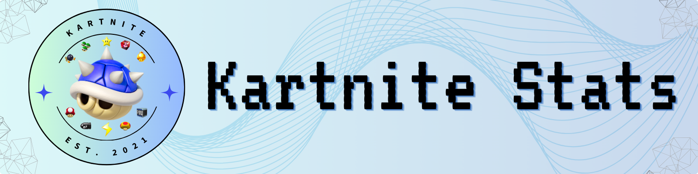

# Background
 My friends and I have been massive fans of the game Mario Kart Wii for years now. We tend to get into friendly arguments about who is the best both of all time and recently. One day, after these debates ensued, one of my friends created an excel spreadsheet to hold our race data so that we can compare our overall stats with one another over time. The issue that we found very quickly was that it was slow and tedious to enter in and difficult to calculate all of the different things that we wanted to see. Thus the idea for a Python program, *Kartnite Stats*, was born. 

**Goal:** This program's goal is to take user inputted *Mario Kart Wii* versus races or time trial personal bests to compute and visualize statistics among friends. 

# Table of Contents
    - discord_bot: Contains code for a discord bot which can run commands related to time_trials
    - documentation: Contains Markdown files describing various things about the repository
    - sample_outputs: Contains sample final-product outputs of this repository. 
    - time_trials: Contains code for one of the two main progams of this repository. Computes the Time Trial Stats
    - versus_races: Contains code for the other of the two main programs of this repository. Compute the Versus Races Stats

# Custom Stats

### Versus Stats
- Track MVP -> A way to determine who is the best player on a given track 
- Kart Score -> A increasing score which determines how a player is playing in a season
- Normalized Kart Score -> A score which determines how a player is playing across all seasons
- Kart Rating -> A percentage based stat to detrmine how much a player is winning
- Kart Versus Rating -> An ELO-like ranking system
- Misc-Score -> A score which aims to intrepret the extra events in a race (Blue Shells, Shocks)
- Seeding Power Points -> A value which overall determines the ranking of each player

### Time Trial Stats
- Standard Times -> Standard times used to determine what tier your personal best falls into. Gathered from the MKWii Players Page (https://www.mariokart64.com/mkw/standardc.php)
- Average Standard Rank -> There are 30 standards tiers, it is the integer average across all categories.
- Track Score -> Players get 1 point per day when having the best time, 0.2 when having the second best time, and 0.04 when having the third best time.

# Notes
All File paths are relative to their respective locations witin the file tree, so if files are moved around these have to be changed. It also means that if you are running the 
code in vscode or another IDE, then the current directory must be set to where the main function lives so that file paths are correct.

wkhtmltopdf is a required executable which I did not create for converting html to pdf. (https://github.com/wkhtmltopdf/wkhtmltopdf). Ensure it is installed at /usr/local/bin/wkhtmltopdf

Unfortunatly wkhtmltopdf needs absolute file paths for the images to be properly found. In Constants.py, set the PATH_EXT variable to the rest of the filepath as needed to solve this. If a change to wkhtmltopdf then I will update as appropriate